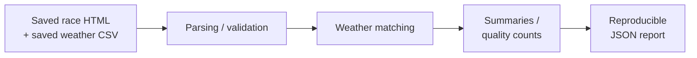

# runwx

runwx turns saved race results and weather data into a report showing finish-time
statistics, rejected result rows and gaps in weather coverage. It records the
input hashes and settings so the analysis can be repeated.

I'm building it to practise data engineering using something I care about: running.

**Current status:** a working local Python command-line tool. The main demo reads
saved Eventrac HTML and weather CSV and prints a JSON report without network access.
The same report also runs in a [local container](docs/container.md).
The secondary [CSV/SQLite activity workflow](docs/development.md#csv-and-sqlite-workflow)
is also available.



## Example result

Summary from the saved **Lydd Half Marathon 2022** report, using the command below.
**The weather values are synthetic demo data, not historical race conditions.**

| Measure | Result |
| --- | --- |
| Candidate / accepted / skipped / invalid rows | 189 / 189 / 0 / 0 |
| Weather matches / accepted results | 188 / 189 |
| Results without matching weather | 1 |
| Best finish time | 4267 seconds |
| Median finish time | 6954 seconds |
| Top-20 median finish time | 4953.5 seconds |

The full JSON also contains source hashes, settings and explicit limitations.
See the [report reference](docs/race-report.md#report-contents) for its contents.

## Quickstart

Start from a checkout of this repository with Python 3.10 or newer installed.
Create and activate a virtual environment using the commands for your shell.

**WSL, Linux or macOS (bash/zsh):**

```bash
python3 -m venv .venv
source .venv/bin/activate
```

**Windows Git Bash, using Windows Python:**

```bash
python -m venv .venv
source .venv/Scripts/activate
```

Then, in either activated environment:

```bash
python -m pip install -e .
python -m runwx report \
  --race-html data/raw/eventrac/lydd_half_2022.html \
  --weather-csv data/sample_lydd_weather_synthetic.csv \
  --course-id lydd-half-marathon --distance-m 21097 \
  --timezone Europe/London --weather-kind synthetic
```

Installation may need internet access to download packages. Report execution
reads only the saved files and prints JSON to the terminal.

The report command was checked in WSL/Ubuntu with Python 3.12.3 using an existing
virtual environment. Fresh installation and the macOS/Windows instructions were
not tested in this documentation check.

## Key engineering decisions

- **Account for every candidate row.** Each is accepted, skipped or invalid, with
  a reason for rejection. The counts reconcile with the saved results table.
- **Keep missing weather visible.** Match the nearest observation to each runner's
  midpoint within 30 minutes by default. Coverage uses accepted results as its
  denominator; missing matches do not remove finishers from race statistics.
- **Record inputs and settings.** Hash the exact bytes being parsed and record
  the analysis settings. A file hash identifies its contents, not its accuracy.
- **Test the offline path.** Report tests block network access, compare repeated
  output and check that changed inputs or settings affect the expected results.

## Tests

After activation, install pytest and the BigQuery extra, then run the full suite.
The warehouse tests use a fake API; no cloud account is needed:

```bash
python -m pip install -e '.[bigquery]' pytest
python -m pytest -q
```

To run only the offline report tests:

```bash
python -m pytest -q tests/test_offline_report.py
```

## Limitations

- The demo weather is synthetic. Its location, provider and capture history are
  unverified; a time match does not establish actual race conditions.
- Saved result completeness and chip/gun timing are unverified. Every runner uses
  the event start because individual start times are unavailable.
- Code and dependency versions are not yet recorded in the report. Repeating the
  output assumes the same inputs, paths, settings, code and environment.

## Next milestone

The [first GCP run](docs/first-cloud-run.md) is verified with fully synthetic inputs.
The [first BigQuery staging load](docs/bigquery-staging.md#verified-cloud-run) also
passed, including a repeat that kept five rows without uploading twice.
The [three dbt views](docs/dbt-models.md#verified-cloud-run) now pass their tests in
BigQuery and match the Python baseline for median/top-N median pace, quality counts
and weather coverage. [Revision selection](docs/warehouse-revisions.md) also passes
its BigQuery tests with synthetic inputs. The guarded selection writer has passed
native update and rollback checks. The analytical views now read selected
revisions and match the corrected Python baseline. Connecting the remaining manual
stages and testing recovery are next.
See the [architecture](docs/architecture.md).

## Development approach

I develop `runwx` with AI assistance alongside hands-on design, testing and review.
I remain responsible for the engineering decisions and for understanding the code.
Expected behaviour and trade-offs are made explicit before consequential changes,
and generated code is checked through focused tests, regression tests and diff review.
The project is also a learning exercise: unfamiliar concepts are worked through,
with small manual changes or tests to reinforce understanding.

## Developer documentation

- [Report fields, parser rules, course identity and time matching](docs/race-report.md)
- [Local result-row export and the roles of SQLite, BigQuery and dbt](docs/result-export.md)
- [First BigQuery staging load: preview, schema and rerun checks](docs/bigquery-staging.md)
- [Code structure, API, contributing and CSV/SQLite usage](docs/development.md)
- [Current architecture and next warehouse milestone](docs/architecture.md)
- [Cloud report contract, runtime permissions and verification](docs/first-cloud-run.md)
