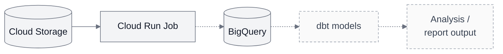

# Architecture

## Implemented today

The [offline report](../README.md) parses and validates saved race/weather files,
matches observations by time and produces JSON with summaries, quality counts,
coverage, input hashes and settings. Domain rules, use-case flows and external I/O
live in separate [package layers](development.md#package-structure-and-api).

The [local result export](result-export.md) also produces one JSON line per candidate
row, with snapshot row identity, validation outcome and weather match. This prepares
the data contract for warehouse loading. The [first staging loader](bigquery-staging.md)
has loaded the synthetic export into a private BigQuery table and verified an equal
rerun without a second upload. This load was triggered locally.

The [deployed cloud path](first-cloud-run.md) reads two synthetic inputs from
private Cloud Storage, runs the same report in one manual Cloud Run Job and saves
JSON back to private Storage. Hash checks reject changed inputs; execution-specific
names and create-only uploads preserve earlier successful reports.

## Planned / next milestone: warehouse analysis

The full path below is planned. Storage, the report job and a manually loaded
BigQuery staging table already work. Today the job saves JSON back to private
Storage; its connection to BigQuery and the dbt stages remain dashed future steps.

The analytical goal is to compare finish times and average paces across suitable
editions of the same course, with weather context. Start with one edition; a
historical comparison needs a second suitable snapshot and comparability checks.
Synthetic demonstrations remain separate from real historical evidence.

Result rows are now in BigQuery. The next output is tested dbt models for median
and top-N median pace, with explicit units, settings, result counts and weather
coverage. Keep parsing and weather alignment in the existing Python code; use
SQL/dbt for warehouse relationships, reconciliation and analytical aggregation.
Reuse existing calculations where appropriate and check shared metrics against
known results. The first models must execute against BigQuery, not only compile.

### Planned dbt models

Build these models in order:

| Model | What one row represents | Main checks |
| --- | --- | --- |
| Staging | One candidate source row in the supplied export. | Unique source-row IDs; accepted + skipped + invalid = candidate count. |
| Accepted-results fact / canonical model | One accepted candidate from that export, with duration in seconds and pace in seconds per kilometre. | Same accepted count as staging; retain finishers without weather. |
| Event-summary mart | One event for the supplied race/weather hashes, interpretation settings and chosen top-N setting. | Summary agreement; quality counts from staging; weather coverage uses all accepted finishers as its denominator. |

The mart will record requested and effective N. The
[existing top-N metric](bigquery-staging.md#metric-contract) is a median of the
fastest N finishers. These models are planned; multi-revision selection and
execution-attempt tracking remain later work.

Historical comparison requires the same canonical course identity plus checked
distance, route and timing comparability. Weather provides context, not a causal
performance adjustment. Later work covers explicit result-revision selection and
failure recovery; scheduling and orchestration are not implemented.

See the [report contract and limitations](race-report.md) and
[cloud verification](first-cloud-run.md#verification).
