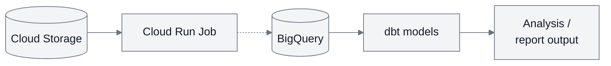

# Architecture

## Implemented today

The [offline report](../README.md) parses and validates saved race/weather files,
matches observations by time and produces JSON with summaries, quality counts,
coverage, input hashes and settings. Domain rules, use-case flows and external I/O
live in separate [package layers](development.md#package-structure-and-api).

The [local result export](result-export.md) also produces one JSON line per candidate
row, with snapshot row identity, validation outcome and weather match. This prepares
the data contract for warehouse loading. The [first staging loader](bigquery-staging.md)
has loaded the synthetic export into a private BigQuery table and verified an equal
rerun without a second upload. This load was triggered locally.

The [deployed cloud path](first-cloud-run.md) reads two synthetic inputs from
private Cloud Storage, runs the same report in one manual Cloud Run Job and saves
JSON back to private Storage. Hash checks reject changed inputs; execution-specific
names and create-only uploads preserve earlier successful reports.

## Warehouse path and remaining integration

Storage, the report job, a manually loaded BigQuery staging table and the three
[verified dbt views](dbt-models.md#verified-cloud-run) work today. The report job
still saves JSON back to private Storage; its connection to warehouse loading
remains the dashed future step. dbt was triggered from a local container.

The analytical goal is to compare finish times and average paces across suitable
editions of the same course, with weather context. Start with one edition; a
historical comparison needs a second suitable snapshot and comparability checks.
Synthetic demonstrations remain separate from real historical evidence.

Result rows and tested dbt views now provide median and top-N median pace, with
units, settings, result counts and weather coverage. Parsing and weather alignment
remain in Python; SQL/dbt handles warehouse relationships, reconciliation and
aggregation. The synthetic warehouse output matched the existing Python baseline.

### dbt models

The verified SQL definitions follow this order. All three are views, which store
SQL and recompute results when queried:

| Model | What one row represents | Main checks |
| --- | --- | --- |
| Staging | One candidate source row in the supplied export. | Unique source-row IDs; accepted + skipped + invalid = candidate count. |
| Accepted-results fact / canonical model | One accepted candidate from that export, with duration in seconds and pace in seconds per kilometre. | Same accepted count as staging; retain finishers without weather. |
| Event-summary mart | One event for the supplied race/weather hashes, interpretation settings and chosen top-N setting. | Summary agreement; quality counts from staging; weather coverage uses all accepted finishers as its denominator. |

The mart records requested and effective N. The
[existing top-N metric](bigquery-staging.md#metric-contract) is a median of the
fastest N finishers. A complete export must have one input/settings context;
mixed or empty contexts fail a data test and produce no summary. An all-rejected
export retains quality counts with null performance metrics. See
[setup and failure behaviour](dbt-models.md).

The [local revision contract](revisions.md) now separates analysis identity,
execution attempts and explicit selection. It retains successful candidate reports
in memory and tests correction, repeat and replay behaviour. The
[warehouse tables and optional selector](warehouse-revisions.md) have also passed
their native BigQuery tests using synthetic inputs. The selector keeps local-only
successes hidden and exposes one explicitly selected, validated revision. The
[verified integration](dbt-models.md#verified-selected-revision-run) feeds those rows
into the three analytical views, using each revision's saved N and separate event
summaries. No selection produces no summary. The deployed correction B summary
matches its Python baseline, with unchanged counts and weather coverage. The
guarded writer has passed native replacement, stale-request and rollback checks.

Historical comparison requires the same canonical course identity plus checked
distance, route and timing comparability. Weather provides context, not a causal
performance adjustment. Later work covers guarded warehouse publication and failure
recovery; scheduling and orchestration are not implemented.

See the [report contract and limitations](race-report.md) and
[cloud verification](first-cloud-run.md#verification).
