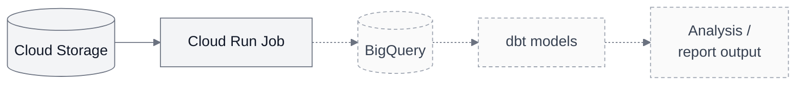

# Architecture

## Implemented today

The [offline report](../README.md) parses and validates saved race/weather files,
matches observations by time and produces JSON with summaries, quality counts,
coverage, input hashes and settings. Domain rules, use-case flows and external I/O
live in separate [package layers](development.md#package-structure-and-api).

The [deployed cloud path](first-cloud-run.md) reads two synthetic inputs from
private Cloud Storage, runs the same report in one manual Cloud Run Job and saves
JSON back to private Storage. Hash checks reject changed inputs; execution-specific
names and create-only uploads preserve earlier successful reports.

## Planned / next milestone: warehouse analysis

The full path below is planned. Cloud Storage and the Cloud Run Job already work;
today the job saves its JSON report back to private Storage. The dashed steps
show the next work: loading result rows into BigQuery and testing dbt models.

The analytical goal is to compare finish times and average paces across suitable
editions of the same course, with weather context. Start with one edition; a
historical comparison needs a second suitable snapshot and comparability checks.
Synthetic demonstrations remain separate from real historical evidence.

The next output is useful result rows in BigQuery and tested dbt models for median
and top-N average pace, with explicit units, settings, result counts and weather
coverage. Keep parsing and weather alignment in the existing Python code; use
SQL/dbt for warehouse relationships, reconciliation and analytical aggregation.
Reuse existing calculations where appropriate and check shared metrics against
known results. The first models must execute against BigQuery, not only compile.

Historical comparison requires the same canonical course identity plus checked
distance, route and timing comparability. Weather provides context, not a causal
performance adjustment. Later work covers explicit result-revision selection and
failure recovery; scheduling and orchestration are not implemented.

See the [report contract and limitations](race-report.md) and
[cloud verification](first-cloud-run.md#verification).
