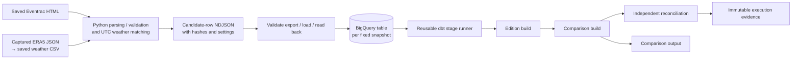
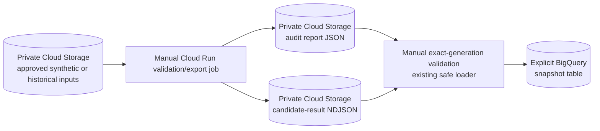

# Architecture

## Historical analysis implemented today

The current analytical output is a [five-edition Lydd comparison](../README.md#real-historical-comparison):
1,197 finishers from fixed 2022–2026 race snapshots, with real hourly
ERA5 weather. Python prepares the inputs; BigQuery and dbt produce the staging,
accepted-results fact, edition summary and comparison views. This flow has run
against BigQuery from local containers, and the same dbt stage runner has now run
inside Cloud Run.



[Source qualification](historical-inputs.md) checks race date/start, timing fields,
row counts, course evidence and weather provenance before an edition is admitted.
Captured source bytes remain unchanged. For 2025, an explicit derived snapshot
retains the 261 complete, provider-reconciled rows; its own hash and mapping back
to the original 399-row capture preserve provenance. The 138 excluded rows are
verified incomplete companions, not a generic deduplication rule. Source-specific
capture and reconciliation remain manual.
New raw captures and per-runner exports stay outside Git; public evidence records
hashes, settings, aggregate results, validation outcomes and limitations.

The [row exporter](result-export.md) reads and hashes the same saved bytes, assigns
each candidate a snapshot row ID, records its validation outcome and aligns weather
to an estimated run midpoint. Weather matching uses aware UTC timestamps, a maximum
30-minute gap by default and the earlier observation for an equal-distance tie.
Unmatched finishers remain in performance statistics.

The [BigQuery loader](bigquery-staging.md) validates the complete export and expected
hash before submission. A pre-created table receives one export using `WRITE_EMPTY`
and `CREATE_NEVER`. Full typed-row readback must match before success is reported;
an identical sequential rerun verifies existing data without another upload.
Changed or extra rows fail verification and are not overwritten.

## Fixed snapshot boundaries

The minimum guarantees are exact snapshot identity/provenance, duplicate-safe
sequential reruns, validation before successful output and distinguishable
deliberate corrections. Row identity combines event identity, the race-file hash
and candidate position; it identifies a source row, not an athlete. Weather hashes
and interpretation settings accompany the export. A corrected export uses a
separate source table and output dataset, preserving the earlier snapshot.

Analyses name their input datasets explicitly. There is no automatic current
revision pointer. Guarded selection, concurrent publication and elaborate receipt
handling remain a separate learning spike; adoption needs a concrete changing-data
or concurrent-writer requirement. The loader assumes controlled sequential use.

The [historical Terraform root](../infra/gcp/historical/README.md) owns only the
chosen snapshot tables and their dbt output datasets. It references the existing
staging dataset and uses separate state from the original cloud demo and parked
experiment. Existing resources/state are preserved; a generic apply of the original
root is not part of the historical workflow. Source tables have no automatic expiry.

<a id="planned-dbt-models"></a>
## dbt models and validation

Each snapshot has three views. The optional comparison adds one logical view in an
explicitly chosen output dataset; two ephemeral input models assemble SQL over the
selected edition datasets. Querying these views recomputes results from the retained
source tables.

| Model | What one row represents | Main checks |
| --- | --- | --- |
| `stg_race_results` | One candidate source row, with flattened settings/weather. | Unique row identity; source reconciliation; consistent validation outcomes. |
| `fct_race_results` | One accepted candidate, with duration and pace. | Accepted count matches staging; finishers without weather remain present. |
| `mart_event_summary` | One complete race/weather/settings context and chosen top-N setting. | Exact median and fastest-N median; quality totals; coverage denominator; one context. |
| `mart_course_comparison` | One explicitly chosen edition dataset, relative to a named baseline. | One summary/output per dataset; matching fact context/counts; baseline cardinality. |

The default [edition graph](dbt-models.md) has 21 tests. It rejects empty or mixed
input contexts instead of emitting a blended summary. An all-rejected export still
reports quality counts with null performance metrics. Requested/effective N remain
visible, and fastest-N is a median of the fastest N finishers.

The [comparison](historical-comparison.md) adds seven tests and exposes mean/median
pace, exact p25/p75, fastest-N median, matched-weather medians and separate pace/
speed changes. Incompatible course, distance or interpretation settings retain raw
statistics with a status and null differences. Different N suppresses only fastest-N
differences. SQL checks do not establish that two physical routes are identical.

The initial 2022/2024 native builds passed 42 tests; the 2023/2026 expansion passed
49. The latest 2025 addition passed 28 tests across its edition build and the
five-edition comparison. Readbacks matched the 37-field new mart and all 62 fields
in each comparison row. [2025 execution evidence](evidence/lydd-2025-validation.json)
separates cached fixture tests, uncached data checks and query usage; the
[previous expansion](evidence/historical-edition-expansion-validation.json) is retained.
CI runs offline Python, container, Terraform and dbt parse checks; it does not
execute warehouse SQL.

<a id="planned--next-milestone-warehouse-analysis"></a>
## Cloud Run validation/export path

The [deployed Cloud Run Job](first-cloud-run.md) runs the existing report and result-
export functions through one small coordinator. Its stored defaults remain **fully
synthetic**. An execution-specific Folkestone 2019 run produced 459 accepted results,
459 weather matches and a byte-identical copy of the frozen warehouse-input NDJSON.
The job does not load BigQuery or invoke dbt.



Input generations and SHA-256 checks bind the downloaded bytes. Execution-specific
object names and create-only uploads retain earlier successful artifacts. NDJSON is
written first and the report envelope last as the pair's completeness marker; a
consumer must require both. The runtime service account can read four exact input
objects and create output objects; it has
no BigQuery loader/dbt permissions. A separate least-privilege build identity can
read Cloud Build source archives, push this repository's image and write build logs.

This verifies real fixed input through the deployed parsing/export boundary. The
exact Folkestone 2019 artifact pair was also read through the manual Storage adapter
and fully matched its existing protected BigQuery snapshot twice, without another
load. This validation/export job still does not load BigQuery or invoke dbt. The dbt
stage is a separate Cloud Run job with its own runtime identity and permissions.
Scheduling, a hosted comparison UI and automatic source refresh remain absent;
manually supplied fixed snapshots remain the release model.

The verified downstream boundary is a thin Storage adapter: it requires exact
report/export generations, verifies the report-last completeness marker and fully
prepares the downloaded NDJSON before delegating to the existing BigQuery loader.
The adapter does not load directly from a Storage URI, create warehouse resources or
choose a destination. Because the target already contained byte-identical rows, the
safe result was `already_present_verified`; no duplicate table or load was needed.
See the [native validation record](evidence/cloud-export-bigquery-validation.json).

The dbt job reuses the same stage runner, locked image, models, tests and
reconciliation code used locally:

```text
dbt stage runner
  → edition build
  → comparison build
  → independent reconciliation
  → immutable evidence
```

A failed stage stops the next stage, although BigQuery views created before a later
failure may remain. Successful and failed executions retain a create-only archive
and completion record. Execution `runwx-dbt-wwjgk` completed the Folkestone 2019
edition build, the three-edition comparison build and independent reconciliation;
its immutable evidence was downloaded and verified. See the
[dbt stage contract](dbt-models.md#cloud-run-dbt-stage).

## Offline entry points and interpretation limits

The [runnable demo](../README.md#runnable-offline-demo--synthetic-weather) uses saved
Lydd 2022 results with **synthetic weather**. The same report runs locally or in a
[container](container.md). Its v1 JSON contains input hashes and settings, but has
no historical-provider/timing qualification; the historical export and companion
provenance records supply that context separately. The
[CSV/SQLite workflow](development.md#csv-and-sqlite-workflow) remains available.
Domain rules, use cases and external I/O follow the existing
[package layers](development.md#package-structure-and-api).

The comparison uses a common 21,097 m pace convention and an explicit unchanged-
course assumption supported by venue/certificate evidence. Provider distances are
retained separately. Every runner uses the event start; individual starts are
unavailable. ERA5 at a venue proxy is matched to estimated midpoints, and hourly
precipitation is not whole-race rainfall. Different fields of runners prevent
attributing the observed pace differences to weather alone.
