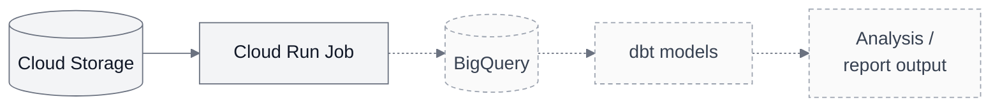

# Architecture

## Planned / next milestone: warehouse analysis

The full path below is planned. Cloud Storage and the Cloud Run Job already work;
today the job saves its JSON report back to private Storage. The dashed steps
show the next work: loading result rows into BigQuery and testing dbt models.

The analytical goal is to compare finish times and average paces across suitable
editions of the same course, with weather context. Start with one edition; a
historical comparison needs a second suitable snapshot and comparability checks.
Synthetic demonstrations remain separate from real historical evidence.

See the [current offline flow](../README.md), [deployed cloud proof](first-cloud-run.md),
[active plan](../RUNWX_PLAN_AND_CODEX_GUIDELINES.md) and [progress](../RUNWX_PROGRESS.md).
